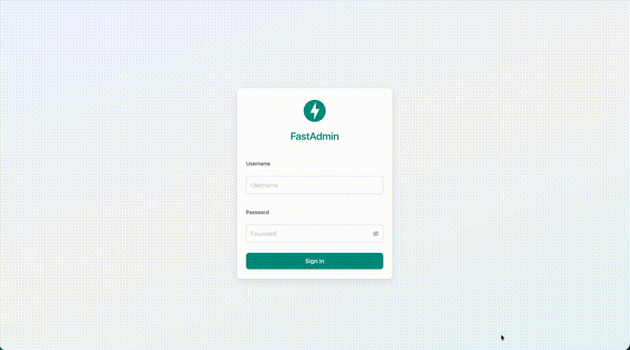

# FastAdmin

**An easy-to-use admin dashboard for FastAPI, Flask and Django — inspired by
[Django Admin](https://docs.djangoproject.com/en/stable/ref/contrib/admin/).**

[](https://github.com/vsdudakov/fastadmin/actions/workflows/ci.yml)
[](https://pypi.org/project/fastadmin/)
[](https://pypi.org/project/fastadmin/)
[](https://github.com/vsdudakov/fastadmin/blob/main/LICENSE.md)

FastAdmin is built with relationships in mind and admiration for Django Admin.
Its design focuses on making it as easy as possible to configure an admin
dashboard for **FastAPI**, **Flask** or **Django** on top of **Tortoise ORM**,
**Django ORM**, **SQLAlchemy** or **Pony ORM**. It aims to be minimal,
functional and familiar.



```python
from fastapi import FastAPI

from fastadmin import TortoiseModelAdmin, register
from fastadmin import fastapi_app as admin_app

from models import User


@register(User)
class UserAdmin(TortoiseModelAdmin):
    list_display = ("id", "username", "is_superuser")

    async def authenticate(self, username: str, password: str) -> int | None:
        user = await User.filter(username=username, is_superuser=True).first()
        if user and user.check_password(password):
            return user.id
        return None


app = FastAPI()
app.mount("/admin", admin_app)
```

[Install FastAdmin :material-arrow-right:](getting-started/installation.md){ .md-button .md-button--primary }
[Quick start :material-arrow-right:](getting-started/quickstart.md){ .md-button }

## Why FastAdmin

- :zap: **Familiar API** — model admins, `list_display`, `list_filter`,
  `search_fields`, inlines, actions — if you know Django Admin, you already
  know FastAdmin.
- :jigsaw: **Framework-agnostic** — mount it into FastAPI, register it as a
  Flask blueprint or include it in Django urlpatterns.
- :file_cabinet: **ORM-agnostic** — first-class admins for Tortoise ORM,
  Django ORM, SQLAlchemy (async) and Pony ORM.
- :bar_chart: **Dashboard widgets** — declarative chart and action widgets
  (line, area, column, bar, pie) with filters, powered by antd charts.
- :outbox_tray: **Uploads & exports** — file/image upload widgets with
  custom storage hooks, CSV/JSON export out of the box.
- :test_tube: **Quality** — fully linted (ruff), typed (mypy) and tested with
  100% backend coverage.

## Explore the docs

<div class="grid cards" markdown>

- :material-rocket-launch: **[Quick start](getting-started/quickstart.md)** —
  a working admin in a few minutes.
- :material-cog: **[Settings](guides/settings.md)** — environment variables
  that configure the dashboard.
- :material-table: **[Registering models](guides/registering-models.md)** —
  full examples for all four ORMs.
- :material-shield-account: **[Authentication](guides/authentication.md)** —
  wire up sign-in for your user model.
- :material-format-list-bulleted: **[Model admins](guides/model-admins.md)** —
  every attribute, method and hook.
- :material-form-select: **[Form widgets & uploads](guides/form-widgets.md)** —
  widget types, `formfield_overrides`, file uploads.
- :material-chart-line: **[Dashboard widgets](guides/dashboard-widgets.md)** —
  charts and actions on the dashboard.

</div>

## Installation

```bash
pip install fastadmin[fastapi,tortoise-orm]
```

See [Installation](getting-started/installation.md) for all framework/ORM
combinations.

## License

FastAdmin is released under the
[MIT License](https://github.com/vsdudakov/fastadmin/blob/main/LICENSE.md).
If you have questions beyond this documentation, feel free to
[email us](mailto:vsdudakov@gmail.com).
